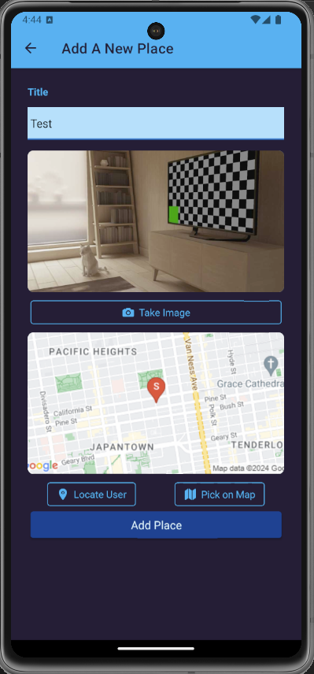

### About

It is a react-native, expo based mobile app to allow users to save and retrieve their favorite location
along with photos and short description.
Some of the technologies involved in here are:-

- React native
- expo (and many of its packages for image capture and others)
- SQLite for persistence (local on the device)
- Google maps

#### scripts

`npm start` will build and run app in simulator. Alternatively scan the QR code to run it in real
device.

#### Landing page (with a location saved)

#### Add a new place

#### Filled form to submit information of a new location

#### Pick a location on google map

#### Saved location details screen

